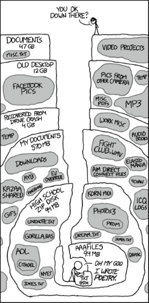

```{css, echo = F}
blockquote {
  background: #f9f9f9;
  border-left: 5px solid #ccc;
  margin: 1.5em 10px;
  padding: 0.5em 1.5em;
}
```

## Objective

Research is tough. Organizing is tough (especially for me). Organizing research is `#@$?&%` tough.

I'm going to share some stuff that has helped me (barely) keep it all together.

*Feel free to interrupt at any point. My mind is chaotic; why should the presentation be any different?*

## Outline

1.  Software
2.  Organization
3.  Workflow
4.  Special Topics


# Software
## {#blockquote .build}

> If all you have is a hammer, everything looks like a nail. - Abraham Maslow

> It is essential to have good tools, but it is also essential that the tools should be used in the right way. - Wallace D. Wattles

> A good tool improves the way you work. A great tool improves the way you think. - Jeff Duntemann

---

The programs that I use:

-   [R](https://www.r-project.org/) version 4.1.0 Camp Pontanezen

-   [RStudio](https://www.rstudio.com/) desktop version 1.4.1106 Tiger Daylily

-   [GitKraken](https://www.gitkraken.com/) version 7.7.2

-   [Zotero](https://www.zotero.org/) 5.0.96.3

    -   [ZotFile](http://zotfile.com/)
    -   [Better BibTeX](https://retorque.re/zotero-better-bibtex/)
    -   [Zotero Connector](https://www.zotero.org/download/connectors)

# Organization 

## {.centered}



---

***Directory structure is the key.***

My approach...

-   Think about where you would look for a given file and which locations you may access frequently (these should set the upper-level structure)
-   Use numbers to order the folders in a way that makes sense (I think of them as building up to a final product)
-   Play around with what feels right to you and what would make sense to others (big for collaboration)

Other approaches \* [Cookiecutter Data Science](https://drivendata.github.io/cookiecutter-data-science/) \* [DZone Data Science Project Folder Structure](https://dzone.com/articles/data-science-project-folder-structure)

## {.smaller}

-   00-Information

-   01-Data

    -   00-Raw-Data
    -   01-Processed-Data
    -   02-Clean-Data

-   02-Scripts

    -   01-Data-Managment-and-Cleaning
    -   02-Exploratory-Analysis
    -   03-Inferential-Analysis

-   03-Output

    -   01-Tables
    -   02-Figures
    -   03-Non-Static

-   04-Report

-   05-Miscellaneous

# Workflow

---

1.  Orient goals of project
2.  Create GitHub Repo
3.  Create R Project
4.  Setup Shell Directory
5.  Populate Directory
6.  Setup Zotero Collection
7.  Code, Search, Analyze
8.  Recode, Research, Reanalyze...
9.  Report
10. Profit ;)

---

***7. Code, Search, Analyze***\
***8. Recode, Research, Reanalyze...***\
***9. Report***

This is where the programs listed before come in handy.

---

Typically, there are data that prompts the beginning of the project. I usually start with an R script to...

-   Import the data

-   *Wrangle* the data into a format conducive to analysis

-   Clean the data (e.g., recode, calculate, set data types, etc.)

-   Save the cleaned data to a native R file

    -   .rds or .rdata

***This script should be the only one to call the raw data.***

---

Then, I'll start a new script for exploration (although I've likely explored the data a bit just with managing it).

I call this script `playground.R` as it is usually very unorganized, undocumented, and really only serves as a place for me to try code that'll be incorporated into another script.

***I don't delete code in this file, only add.***

---

Finally, I'll do one of two things for the main analysis

-   Write a script that would...

    -   Import the data output from the management script
    -   Generate output to be used in reporting (e.g., presentations or manuscripts)

-   Begin an RMarkdown that would...

    -   Do everything the standalone script would
    -   Block out key parts of the analysis using code chunks
    -   Allow me to write alongside code

---

RMarkdown is super powerful and convenient.

I have began to tend towards using `bookdown::word_document2` for my output.

Key advantage: **in-text references**. *Note, these are different from citations.*

---

Using `bookdown::word_document2` output, you can *refer* to a table or figure or section **dynamically**, meaning that you won't have to update numbering schemes AND it will place a link to jump to the reference.

```{r example}
knitr::kable(iris[1:3, 1:3], caption = "This is an example table")
```

I would refer to the table using \@ref(tab:example) which would render as something like **Table 1**.

## Workflow, cont'd

Moving past coding and more into writing (particularly citations), using RStudio and Zotero makes things much easier.

Enter, ***Visual Markdown Editor*** mode.


------------------------------------------------------------------------

In this mode you can write in a format more similar to other word processors (in stead of markdown syntax).

The key advantage is how it can help with citations.

All you have to do is type \@ and the editor will start to autofill suggestions for references and prompt to add it to a .bib file. 


# Special Topics


## Recommended Packages

* `dplyr`
* `tidyr`
* `purrr`
* `flextable`


## For Parallel Processing

* `doParallel`
* `doRNG`


## For Network Analysis

* `igraph`
* `networkD3` (?)


## Random Stuff I've Done With R

* Browser Automation for Web-Scraping
* Shiny Apps and Interactive Documents
* Semi-Automated Lit Review


